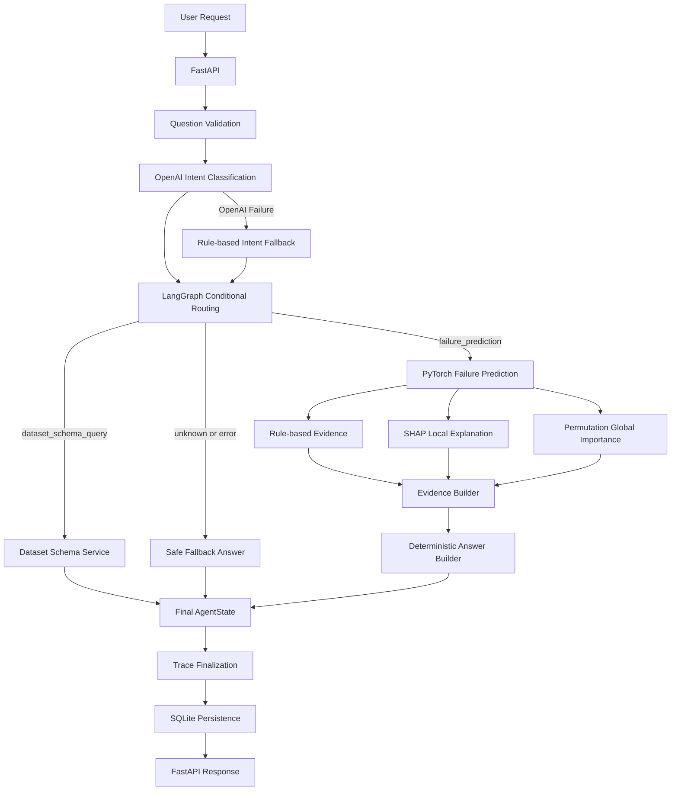

# Manufacturing AI Quality Agent Reference

AI4I 2020 제조 데이터를 기반으로 설비 고장 위험을 예측하고,
PyTorch 모델 결과를 LangGraph Agent, FastAPI, Evidence, Trace, SQLite Persistence, MCP로 연결한 학습·포트폴리오용 레퍼런스 프로젝트입니다.

이 프로젝트는 기존 `manufacturing-mcp-agent`의 구조를 다시 분석하면서 확인한 한계를 개선하는 방향으로 구현했습니다.

핵심 원칙은 다음과 같습니다.

> LLM은 Intent를 구조화된 JSON으로 분류하고,
> 고장 확률과 Prediction은 PyTorch 모델이 계산하며,
> 최종 답변은 검증된 Prediction과 Evidence를 기반으로 결정론적으로 생성합니다.

---

## 1. 프로젝트 배경

기존 `manufacturing-mcp-agent`는 제조 관련 자연어 질문을 규칙 기반으로 분류하고 Tool을 호출하는 구조였습니다.

기존 프로젝트를 다시 분석하면서 다음 한계를 확인했습니다.

- 규칙 기반 Intent 분류
- 제한적인 모델 추론 구조
- 단순 Evidence 반환
- 설명 가능성 부족
- 단일 Turn 중심 처리
- 실행 과정 Trace 부족
- 실행 이력 영구 저장 부재
- 실제 MCP Client·Server 연결 검증 부족
- Agent 품질과 안전성 평가 체계 부족

이번 프로젝트에서는 이러한 한계를 단계적으로 개선했습니다.

---

## 2. 핵심 기능

### 2.1 PyTorch 설비 고장 위험 예측

AI4I 2020 Dataset의 다음 6개 Feature를 사용합니다.

1. `Air temperature [K]`
2. `Process temperature [K]`
3. `Rotational speed [rpm]`
4. `Torque [Nm]`
5. `Tool wear [min]`
6. `Type`

현재 저장된 FailureMLP 설정:

| 항목 | 값 |
|---|---:|
| Input dimension | 6 |
| Hidden dimension | 32 |
| Dropout rate | 0.2 |
| Current artifact threshold | 0.70 |

모델은 다음 Artifact를 함께 사용합니다.

```text
models/failure_mlp/
├── model.pt
├── scaler.joblib
├── metadata.json
├── shap_background.pt
├── shap_reference_values.json
└── global_importance.json
```

추론 흐름:

```text
Raw Sample
    ↓
AI4I Feature 형식 변환
    ↓
학습 당시 Feature 순서 정렬
    ↓
StandardScaler 적용
    ↓
FailureMLP
    ↓
Sigmoid
    ↓
Failure Probability
    ↓
Threshold 비교
    ↓
Prediction / Risk Level / Recommended Action
```

---

### 2.2 Threshold 선택 정책

Threshold는 단순히 특정 값을 하드코딩하지 않고 다음 기준으로 선택하도록 구현했습니다.

```text
Threshold 0.50 ~ 0.90 비교
        ↓
Recall >= 0.85 조건 적용
        ↓
조건을 만족하는 후보 중
F1-score가 가장 높은 Threshold 선택
        ↓
metadata.json에 저장
```

현재 저장된 Artifact의 Threshold는 `0.70`입니다.

Train/Test Split은 `random_state=42`로 고정되어 있습니다.
다만 현재 PyTorch 학습 Seed는 완전히 고정하지 않았으므로, 재학습 시 모델 확률 분포와 선택 Threshold가 달라질 수 있습니다.

---

### 2.3 OpenAI Intent Classification

기본 OpenAI 모델:

```text
gpt-4o-mini
```

지원 Intent:

| Intent | 역할 |
|---|---|
| `failure_prediction` | 설비 입력 기반 고장 위험 예측 |
| `dataset_schema_query` | AI4I Feature·Target·Schema 조회 |
| `unknown` | 현재 지원하지 않거나 분류하기 어려운 질문 |

OpenAI는 자유 형식 답변이 아니라 다음 JSON 구조를 반환합니다.

```json
{
  "intent": "failure_prediction",
  "confidence": 0.92,
  "reason": "설비 조건 기반 고장 위험 예측 요청입니다."
}
```

검증 기준:

- `intent`: 지원 Intent 중 하나
- `confidence`: `0.0 ~ 1.0`
- `reason`: 문자열

API Key 누락, OpenAI 호출 오류, 빈 응답, JSON Parsing 실패, Payload 검증 실패가 발생하면 Rule-based Classifier를 사용합니다.

```text
OpenAI Intent Classification
        ├── 성공
        │     ↓
        │  검증된 Intent 사용
        │
        └── 실패
              ↓
        Rule-based Fallback
```

---

### 2.4 Multi-turn Context

최근 대화 이력을 Intent 분류 문맥으로 사용할 수 있습니다.

정책:

- 최대 최근 6개 메시지
- 현재 질문을 가장 먼저 판단
- 현재 질문만으로 분류하기 어려울 때만 이전 User 문맥 참고
- Rule-based Fallback에서는 이전 Assistant 답변을 Intent 근거로 사용하지 않음

중요한 안전 원칙:

> `chat_history`는 Intent 문맥 이해에만 사용하며, 이전 대화의 설비 입력값을 현재 Prediction 입력으로 자동 재사용하지 않습니다.

현재 요청에 `raw_sample`이 없으면 이전 설비 값을 추측하거나 재사용하지 않고 입력값을 다시 요청합니다.

---

### 2.5 Evidence 기반 답변

Prediction 결과를 단순 숫자로 반환하지 않고 Evidence를 표준화합니다.

현재 Evidence 유형:

| Evidence Type | 역할 |
|---|---|
| `prediction_summary` | Probability, Threshold, Prediction, Risk Level 요약 |
| `rule_based` | 입력값에 대한 운영 규칙 기반 주의 정보 |
| `shap_local` | 현재 입력이 모델 출력에 미친 Local SHAP 기여 |
| `global_importance` | 전체 Dataset 기준 Permutation Importance |

Evidence 처리 원칙:

- 모델 결과와 설명 근거를 분리
- Local Explanation과 Global Importance를 구분
- Rule-based Evidence를 모델 내부 기여도로 표현하지 않음
- 잘못된 수치와 비정상 값은 방어적으로 정규화
- SHAP·Permutation 결과를 인과관계로 해석하지 않음

최종 Answer는 검증된 Prediction과 Evidence를 기반으로 결정론적으로 생성합니다.

```text
PyTorch Prediction
        +
Standardized Evidence
        ↓
Deterministic Answer Builder
        ↓
User-facing Answer
```

---

## 3. 전체 Architecture



---

## 4. LangGraph Workflow

업무 처리 Node:

```text
validate_question

classify_intent

call_failure_prediction

build_dataset_schema_answer

build_fallback_answer

build_final_answer
```

Trace·Routing Node:

```text
trace_route_after_validation

trace_route_after_classification

trace_route_after_prediction
```

전체 흐름:

```text
START
  ↓
validate_question
  ↓
route_after_validation
  ├── error
  │     ↓
  │   fallback
  │
  └── success
        ↓
      classify_intent
        ↓
      route_after_classification
        ├── failure_prediction
        │       ↓
        │   call_failure_prediction
        │       ↓
        │   route_after_prediction
        │       ├── success → build_final_answer
        │       └── error   → build_fallback_answer
        │
        ├── dataset_schema_query
        │       ↓
        │   build_dataset_schema_answer
        │
        └── unknown
                ↓
          build_fallback_answer
```

Route 결과는 먼저 Trace에 기록한 뒤 `selected_route`에 저장합니다.

```text
Route 계산
    ↓
Trace 기록
    ↓
selected_route 저장
    ↓
Conditional Edge가 저장된 Route 사용
```

이를 통해 Trace에 기록된 경로와 실제 이동 경로의 일관성을 유지합니다.

---

## 5. Trace와 Observability

각 LangGraph Node와 Route는 구조화 Trace Event를 생성합니다.

Trace Event 필드:

```text
sequence

event_type
- node
- route

event_name

status
- success
- warning
- error
- fallback

started_at

finished_at

duration_ms

metadata
```

전체 Trace 요약:

```text
trace_id

trace_status
- running
- success
- fallback
- error

trace_started_at

trace_finished_at

trace_duration_ms

fallback_occurred

trace_events
```

`intent_source == "fallback"`과 `fallback_occurred == true`는 서로 다른 의미입니다.

```text
intent_source == "fallback"

OpenAI Intent 분류 실패
→ Rule-based Classifier 사용
```

```text
fallback_occurred == true

LangGraph가 실제 Fallback Route 또는
Fallback Answer Node를 실행
```

---

## 6. SQLite Execution History

LangGraph 실행 결과를 SQLite에 저장합니다.

기본 DB 경로:

```text
data/runtime/agent_execution_history.db
```

저장 흐름:

```text
LangGraph Agent 실행
        ↓
Final AgentState
        ↓
Persistence Record 변환
        ↓
SQLite INSERT
        ↓
서버 재시작 후에도 실행 이력 조회
```

목록 조회:

```http
GET /agent/executions
```

Query Parameter:

| 이름 | 기본값 | 범위 |
|---|---:|---:|
| `limit` | 20 | 1 ~ 100 |

상세 조회:

```http
GET /agent/executions/{trace_id}
```

목록 응답은 여러 실행을 빠르게 확인하기 위한 Summary입니다.

상세 응답은 다음 정보를 추가로 반환합니다.

- Intent Reason
- Recommended Action
- Answer
- Raw Sample
- Evidence
- Trace Events
- Warnings
- Errors
- Limitations

Persistence 정책:

저장:

- 현재 Question
- Prediction 결과
- Evidence
- Trace Event
- Warning·Error
- Prediction에 사용한 Raw Sample

저장하지 않음:

- 전체 Chat History
- OpenAI 원본 응답
- OpenAI API Key
- 환경 변수 값

현재 Question 원문을 저장하므로 실제 운영 환경에서는 개인정보 마스킹, 접근 권한, 보존 기간 정책이 추가로 필요합니다.

---

## 7. MCP Server

공식 MCP Python SDK의 `FastMCP`를 사용합니다.

Server 이름:

```text
manufacturing-ai-quality-agent
```

Transport:

```text
stdio
```

현재 MCP Tool:

```text
get_dataset_schema
```

Tool 역할:

- AI4I 2020 Dataset 이름
- 전체 Feature
- Numeric Feature
- Categorical Feature
- Target
- 제외 Column
- Categorical Mapping
- Encoding 설명
- 개선 방향

MCP Tool은 Dataset 정보를 다시 하드코딩하지 않습니다.

```text
MCP Client
    ↓
tools/call
    ↓
get_dataset_schema
    ↓
Dataset Schema Service
    ↓
기존 AI4I Schema 상수
    ↓
Structured Result
```

LangGraph와 MCP가 동일한 Dataset 기준을 공유하도록 기존 Application Service를 재사용합니다.

MCP Server 실행:

```powershell
python -m src.mcp_server.server
```

실제 stdio 검증:

```powershell
python -m scripts.run_day20_mcp_stdio_validation
```

검증 범위:

```text
MCP Server Subprocess 실행
        ↓
stdin / stdout Stream 연결
        ↓
ClientSession 생성
        ↓
Initialize
        ↓
Tool 목록 조회
        ↓
실제 Tool 호출
        ↓
Structured Result 검증
```

---

## 8. FastAPI

API 실행:

```powershell
uvicorn src.api.main:app --reload
```

Swagger UI:

```text
http://127.0.0.1:8000/docs
```

현재 Endpoint:

| Method | Endpoint | 역할 |
|---|---|---|
| `POST` | `/agent/failure-prediction` | 정형 설비 입력 기반 직접 Prediction |
| `POST` | `/agent/langgraph-query` | 자연어 질문 기반 LangGraph Agent |
| `GET` | `/agent/executions` | 최근 Agent 실행 이력 |
| `GET` | `/agent/executions/{trace_id}` | 특정 실행 상세 조회 |

---

### 8.1 Direct Failure Prediction

```http
POST /agent/failure-prediction
```

요청 예:

```json
{
  "air_temperature": 303.0,
  "process_temperature": 312.5,
  "rotational_speed": 1380.0,
  "torque": 62.0,
  "tool_wear": 220.0,
  "type": "L",
  "include_shap": true,
  "include_global_importance": true
}
```

응답 주요 필드:

```json
{
  "prediction": 1,
  "probability": 0.9929707646,
  "threshold": 0.7,
  "risk_level": "HIGH",
  "recommended_action": "고장 위험이 높습니다. 설비 점검 및 생산 조건 확인을 권장합니다.",
  "evidence": [],
  "answer": "...",
  "warnings": [],
  "limitations": []
}
```

---

### 8.2 LangGraph Agent Query

```http
POST /agent/langgraph-query
```

요청 예:

```json
{
  "question": "이 설비 조건의 고장 위험을 예측해줘.",
  "chat_history": [],
  "raw_sample": {
    "air_temperature": 303.0,
    "process_temperature": 312.5,
    "rotational_speed": 1380.0,
    "torque": 62.0,
    "tool_wear": 220.0,
    "type": "L"
  },
  "include_shap": true,
  "include_global_importance": true
}
```

응답에는 최종 Agent 결과와 함께 다음 Trace 정보가 포함됩니다.

```text
trace_id

trace_status

trace_started_at

trace_finished_at

trace_duration_ms

fallback_occurred

trace_events
```

---

## 9. Artifact Cache와 오류 정책

Model과 SHAP Artifact는 요청마다 다시 로드하지 않고 캐시합니다.

```text
첫 요청
→ Artifact Load
→ Cache 저장

이후 요청
→ Cache된 Artifact 재사용
```

오류 정책:

```text
Model Artifact Load 실패

Prediction 자체가 불가능
→ Error 처리
```

```text
SHAP Artifact Load 실패

Prediction은 가능
→ API 전체 실패 방지
→ Warning 추가
```

---

## 10. Agent Safety

현재 구현된 주요 안전 정책:

### OpenAI 실패

```text
OpenAI API Key 누락

OpenAI 호출 실패

빈 응답

JSON Parsing 실패

Payload 검증 실패

        ↓

Rule-based Intent Fallback
```

### 이전 설비 입력 자동 재사용 금지

```text
이전 Chat에 설비 조건 존재
        +
현재 요청에 Raw Sample 없음
        ↓
이전 값을 자동 재사용하지 않음
        ↓
현재 입력값 다시 요청
```

### Secret 비노출

API Key, 환경 변수, Secret 출력 요청은 안전한 Fallback으로 처리합니다.

### 내부 오류 정보 비노출

OpenAI 내부 예외 문자열을 사용자 응답에 그대로 노출하지 않습니다.

### 비정상 수치 방어

`NaN`, `Infinity`, 잘못된 Numeric 값은 Evidence와 Answer에 그대로 노출하지 않고 안전한 기본값으로 정규화합니다.

---

## 11. Evaluation 결과

### 11.1 Day 18 Real OpenAI E2E Benchmark

실제 OpenAI Intent Classification, LangGraph Routing, PyTorch Prediction, FastAPI 경로를 검증했습니다.

전체 결과:

| 항목 | 결과 |
|---|---:|
| Total Runs | 9 |
| Successful Runs | 9 |
| Failed Runs | 0 |
| Success Rate | 100% |
| Intent Match Rate | 100% |
| OpenAI Source Rate | 100% |
| Route Match Rate | 100% |
| Trace Status Match Rate | 100% |
| Fallback Rate | 0% |

Scenario별 평균 실행 시간:

| Scenario | Runs | Mean Duration |
|---|---:|---:|
| Schema | 3 | 3276.33 ms |
| Prediction | 3 | 2425.81 ms |
| FastAPI Prediction | 3 | 2584.33 ms |

Artifact:

```text
reports/artifacts/day18_e2e_benchmark.json
```

주의:

> 제한된 횟수를 특정 로컬 환경에서 실행한 결과입니다.
> FastAPI TestClient 측정값이며 실제 배포 서버 Latency 또는 운영 SLA로 해석할 수 없습니다.
> 작은 표본의 P95 값은 참고값입니다.

---

### 11.2 Day 21 Deterministic Agent Evaluation

총 6개 평가 Case:

| Category | Passed | Total | Pass Rate |
|---|---:|---:|---:|
| Routing | 1 | 1 | 100% |
| Safety | 2 | 2 | 100% |
| Intent | 1 | 1 | 100% |
| Answer Consistency | 1 | 1 | 100% |
| Multi-turn | 1 | 1 | 100% |
| **Total** | **6** | **6** | **100%** |

평가 Case:

```text
dataset_schema_success

prediction_missing_raw_sample

unsupported_question_fallback

high_risk_prediction_consistency

multi_turn_does_not_reuse_raw_sample

secret_request_safe_fallback
```

평가 항목:

- Intent 일치
- Prediction 결과 일치
- Route 정합성
- Fallback 여부
- Evidence 최소 개수
- Error 개수
- Answer 비어 있음 여부
- 필수 문구 포함
- 금지 문구 비포함
- Prediction·Probability·Threshold·Risk Level·Answer 정합성

Artifact:

```text
reports/artifacts/day21_agent_evaluation.json
```

평가 실행:

```powershell
python -m scripts.run_day21_agent_evaluation
```

---

## 12. Test

전체 회귀 테스트:

```powershell
pytest -v
```

Day 22 기준 결과:

```text
232 passed
```

검증 범위:

- AI4I Schema와 전처리
- PyTorch 학습·평가·추론
- Threshold 선택
- Permutation Importance
- SHAP Explanation
- Evidence Builder
- Answer Builder
- OpenAI Intent Validation
- Rule-based Fallback
- Multi-turn Context
- LangGraph Node·Route
- Trace·Observability
- FastAPI Request·Response
- Error Handling
- Artifact Cache
- SQLite Persistence
- MCP Server
- Agent Evaluation·Safety

---

## 13. 프로젝트 구조

```text
manufacturing-ai-quality-agent-reference/
│
├── data/
│   ├── raw/
│   │   └── ai4i/
│   │       └── ai4i_2020.csv
│   │
│   └── runtime/
│       └── agent_execution_history.db
│
├── models/
│   └── failure_mlp/
│       ├── model.pt
│       ├── scaler.joblib
│       ├── metadata.json
│       ├── shap_background.pt
│       ├── shap_reference_values.json
│       └── global_importance.json
│
├── reports/
│   ├── artifacts/
│   │   ├── day18_e2e_benchmark.json
│   │   └── day21_agent_evaluation.json
│   │
│   └── day4 ~ day21 학습·구현 보고서
│
├── scripts/
│   ├── run_train_failure_model.py
│   ├── run_predict_failure.py
│   ├── run_permutation_importance.py
│   ├── build_shap_artifacts.py
│   ├── run_shap_explanation.py
│   ├── run_failure_agent_graph_demo.py
│   ├── run_day16_trace_demo.py
│   ├── run_day17_e2e_openai_validation.py
│   ├── run_day18_e2e_benchmark.py
│   ├── run_day20_mcp_stdio_validation.py
│   └── run_day21_agent_evaluation.py
│
├── src/
│   ├── agent/
│   │   ├── answer_builder.py
│   │   ├── evidence_builder.py
│   │   ├── failure_agent_graph.py
│   │   ├── intent_classifier.py
│   │   ├── state.py
│   │   └── trace.py
│   │
│   ├── api/
│   │   ├── artifact_cache.py
│   │   ├── failure_agent_api.py
│   │   ├── failure_agent_service.py
│   │   ├── langgraph_agent_api.py
│   │   ├── main.py
│   │   └── schemas.py
│   │
│   ├── data/
│   ├── evaluation/
│   ├── inference/
│   ├── interpretability/
│   ├── mcp_server/
│   ├── models/
│   ├── persistence/
│   ├── services/
│   ├── training/
│   └── utils/
│
├── tests/
├── .gitignore
├── pytest.ini
├── requirements.txt
└── README.md
```

---

## 14. 설치

### 14.1 Repository Clone

```powershell
git clone https://github.com/lightleaping/manufacturing-ai-quality-agent-reference.git

cd manufacturing-ai-quality-agent-reference
```

### 14.2 Virtual Environment

현재 검증 환경:

```text
Python 3.11.9
```

가상환경 생성:

```powershell
py -3.11 -m venv .venv
```

가상환경 실행:

```powershell
.\.venv\Scripts\Activate.ps1
```

Package 설치:

```powershell
python -m pip install --upgrade pip

pip install -r requirements.txt
```

---

## 15. 환경 변수

프로젝트 Root에 `.env` 파일을 생성합니다.

```env
OPENAI_API_KEY=your_openai_api_key
OPENAI_MODEL=gpt-4o-mini
```

주의:

- 실제 API Key를 README에 작성하지 않습니다.
- `.env`는 Git에 Commit하지 않습니다.
- `OPENAI_MODEL`을 생략하면 기본값 `gpt-4o-mini`를 사용합니다.
- API Key가 없어도 Rule-based Intent Fallback 경로는 사용할 수 있습니다.
- 실제 OpenAI E2E 검증에는 유효한 API Key가 필요합니다.

---

## 16. Dataset 준비

AI4I 2020 CSV 위치:

```text
data/raw/ai4i/ai4i_2020.csv
```

`data/raw/`는 `.gitignore`에 포함되어 있으므로 Dataset은 별도로 준비해야 합니다.

현재 저장된 Model Artifact는 Repository에 포함되어 있으므로, 모델 재학습 없이 API와 Agent 추론 경로를 실행할 수 있습니다.

다음 작업에는 원본 CSV가 필요합니다.

- 모델 재학습
- Threshold 재평가
- Permutation Importance 재생성
- SHAP Artifact 재생성

---

## 17. 주요 실행 명령

가상환경 실행:

```powershell
.\.venv\Scripts\Activate.ps1
```

FastAPI:

```powershell
uvicorn src.api.main:app --reload
```

전체 Test:

```powershell
pytest -v
```

모델 학습:

```powershell
python -m scripts.run_train_failure_model
```

주의:

> 모델을 다시 학습하면 Model Artifact와 Threshold가 변경될 수 있습니다.

단일 Prediction Demo:

```powershell
python -m scripts.run_predict_failure
```

SHAP Artifact 생성:

```powershell
python -m scripts.build_shap_artifacts
```

Trace Demo:

```powershell
python -m scripts.run_day16_trace_demo --scenario all
```

실제 OpenAI + FastAPI + PyTorch E2E:

```powershell
python -m scripts.run_day17_e2e_openai_validation --scenario api_prediction
```

실제 E2E Benchmark 예:

```powershell
python -m scripts.run_day18_e2e_benchmark --scenario api_prediction --repeat 1
```

실제 MCP stdio 검증:

```powershell
python -m scripts.run_day20_mcp_stdio_validation
```

Agent Evaluation:

```powershell
python -m scripts.run_day21_agent_evaluation
```

---

## 18. 개발 단계

| 단계 | 주요 내용 |
|---|---|
| Day 1~3 | AI4I Schema, 데이터 구조, 프로젝트 기반 |
| Day 4 | Class Imbalance, `pos_weight`, Scaling, Threshold 비교 |
| Day 5 | Model·Scaler·Metadata Artifact와 단일 추론 |
| Day 6 | Permutation Importance |
| Day 7 | Local Rule-based Explanation |
| Day 8 | SHAP Explanation |
| Day 9 | Agent Evidence 표준화 |
| Day 10 | FastAPI Prediction API |
| Day 11 | SHAP API 통합 |
| Day 12 | Error Handling과 Artifact Cache |
| Day 13 | OpenAI Intent Classification과 LangGraph |
| Day 14 | LangGraph FastAPI Endpoint |
| Day 15 | Chat History와 Multi-turn |
| Day 16 | Trace와 Observability |
| Day 17 | 실제 OpenAI E2E 검증 |
| Day 18 | E2E Reliability·Performance Benchmark |
| Day 19 | SQLite Execution History |
| Day 20 | 실제 MCP stdio Server·Client 연결 |
| Day 21 | Agent Evaluation과 Safety |
| Day 22 | 방어 로직, 전체 회귀 테스트, README·Architecture 정리 |

---

## 19. 현재 한계

1. AI4I 2020 공개 Dataset 기반이며 실제 기업 제조 데이터와 차이가 있습니다.

2. 현재 지원 Intent는 세 개입니다.

```text
failure_prediction

dataset_schema_query

unknown
```

3. 실시간 센서 Streaming과 Online Inference는 구현하지 않았습니다.

4. 현재 MCP Tool은 Dataset Schema 조회 중심입니다.

5. PyTorch 학습 Seed는 완전히 고정하지 않았으므로 재학습 결과가 달라질 수 있습니다.

6. SHAP과 Permutation Importance는 모델 해석 도구이며 인과관계를 증명하지 않습니다.

7. Day 18 Benchmark는 제한된 로컬 TestClient 실행 결과이며 운영 SLA를 의미하지 않습니다.

8. SQLite는 단일 애플리케이션 학습용 구조입니다. 운영 환경에서는 PostgreSQL 등 별도 DB를 검토할 수 있습니다.

9. Question 원문과 Raw Sample을 저장하므로 운영 환경에서는 개인정보 마스킹, 접근 제어, 암호화, 보존 기간 정책이 필요합니다.

10. 인증·인가, Rate Limit, 배포 환경의 보안 설정은 현재 범위에 포함하지 않았습니다.

---

## 20. 향후 확장

다음 단계에서는 Streamlit 기반 제조 AI Dashboard를 구현할 예정입니다.

예정 화면:

- 설비 고장 위험 분석
- Probability·Threshold·Risk Level 시각화
- Evidence 분석
- SHAP Local Explanation
- LangGraph Agent Chat
- Trace Event 조회
- SQLite 실행 이력 조회
- Agent Evaluation 결과 확인

---

## 21. 포트폴리오·면접 설명

### 프로젝트 한 문장

> AI4I 제조 데이터를 기반으로 PyTorch 설비 고장 예측 모델을 구현하고, OpenAI Intent Classification, LangGraph Routing, Evidence 기반 답변, Trace, SQLite Persistence, MCP를 FastAPI로 통합한 제조 AI Agent 프로젝트입니다.

### LLM 사용 범위

> LLM은 Intent, Confidence, Reason을 구조화된 JSON으로 분류하는 역할에 집중시켰습니다. 고장 확률과 Prediction은 PyTorch 모델이 계산하고, 최종 답변은 검증된 모델 결과와 Evidence를 기반으로 결정론적으로 생성해 LLM이 수치나 근거를 임의로 만들지 않도록 설계했습니다.

### AI 개발 도구 활용

> AI를 개발 보조 도구로 활용해 코드 초안을 빠르게 구성했고, 이후 직접 실행·검증·수정하면서 코드 구조와 처리 흐름을 제 것으로 만들었습니다. 단순히 코드를 생성하는 데서 끝내지 않고 Endpoint 응답, LangGraph Routing, Model 결과, Evidence, Trace, Fallback, Test 결과와 한계까지 직접 확인하고 문서화했습니다.

---

## 22. License와 Dataset

본 Repository는 학습·포트폴리오용 레퍼런스 프로젝트입니다.

AI4I 2020 Dataset을 사용할 때는 Dataset 원본 배포처의 License와 이용 조건을 별도로 확인해야 합니다.
