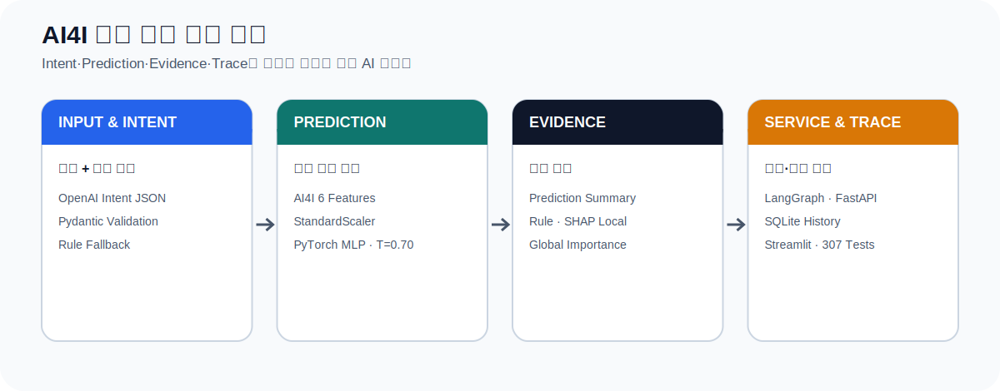
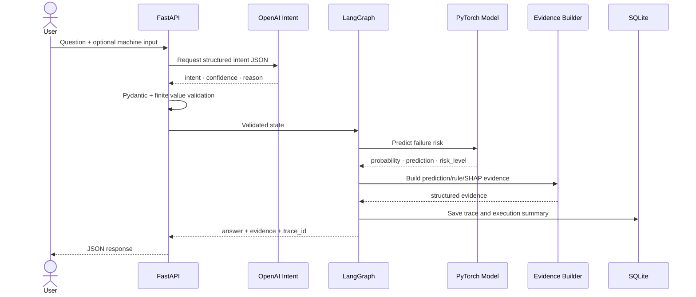

# AI4I 기반 설비 고장 예측

**저장소 ID:** `manufacturing-ai-quality-agent-reference`

> **AI4I 제조 설비 데이터로 고장 위험을 예측하고,
> PyTorch Prediction을 Evidence·Trace·SQLite History와 함께 제공하는 제조 AI Agent**

<p>
  
  
  
  
</p>

<p align="center">
  
</p>

[Profile](https://github.com/lightleaping) · [Architecture](#4-system-architecture) · [Evaluation](#3-key-results--evaluation) · [Run](#11-how-to-run)

---

## Recruiter Summary

| 구분 | 내용 |
|---|---|
| 기간 | **2026.05 ~ 2026.07** |
| 형태 | 개인 프로젝트 · 1인 개발 |
| 문제 | 고장 확률만 반환하는 모델은 판단 이유와 Agent 실행 과정을 확인하기 어려움 |
| 목표 | 모델 예측·설명 근거·실행 이력을 하나의 제조 AI 서비스로 연결 |
| 범위 | 데이터 분석 → MLP → Threshold → SHAP → LangGraph → FastAPI → SQLite → Streamlit |
| 내 역할 | 기획·설계·모델 개발·Agent Workflow·API·Dashboard·평가·테스트·문서화 전반 |
| 핵심 기술 | Python, PyTorch, LangGraph, OpenAI API, SHAP, FastAPI, MCP, SQLite, Streamlit |

---

## Problem → Action → Evaluation

| Problem · 왜 필요한가 | Action · 어떻게 해결했는가 | Evaluation · 무엇으로 검증했는가 |
|---|---|---|
| AI4I 데이터는 고장 Class가 약 3.4%로 불균형해 Accuracy만 보면 모델이 모든 입력을 정상으로 판단해도 높게 보일 수 있음 | `pos_weight`, StandardScaler, Threshold 비교를 적용 | Precision·Recall·F1·Confusion Matrix·FN |
| 고장 확률만으로 HIGH·MEDIUM·LOW 판단의 이유를 설명하기 어려움 | Prediction·Rule·SHAP Evidence를 분리해 구조화 | Evidence schema·정합성 Test |
| LLM이 수치와 결과까지 생성하면 모델 결과가 바뀌거나 근거 없는 답변이 생길 수 있음 | LLM은 Intent와 쉬운 설명, PyTorch는 Prediction, 정책은 Risk Level 담당 | 6/6 Agent 평가·실제 OpenAI E2E |
| API 응답 이후 실행 과정을 재확인하기 어려움 | Trace Event와 실행 요약을 SQLite에 저장 | History API·재조회·Dashboard·회귀 테스트 |

---

## 1. Why This Project

제조 설비 고장 위험 예측은 단순한 확률 반환으로 끝나기 어렵습니다.

- 데이터가 불균형하면 높은 Accuracy가 실제 고장 탐지 성능을 의미하지 않을 수 있음
- 고장 위험이 높다는 결과에 어떤 입력 특성이 영향을 주었는지 확인할 필요가 있음
- 자연어 질문, 모델 추론, 근거 생성, 답변 생성의 역할을 분리해야 함
- 오류가 발생한 위치와 실행 결과를 다시 확인할 Trace가 필요함
- Dashboard가 모델 정책을 중복 구현하지 않고 Backend 결과를 그대로 사용해야 함

핵심 원칙:

> **LLM은 Intent를 구조화된 JSON으로 분류하고,
> 고장 확률과 Prediction은 PyTorch 모델이 계산하며,
> 최종 답변은 검증된 Prediction과 Evidence를 기반으로 생성합니다.**

---

## 2. Project Scope

### Data & Model

- AI4I 2020 Predictive Maintenance Dataset
- 10,000 rows
- Train 8,000 / Test 2,000
- Input Feature 6개
- PyTorch MLP: `6 → 32 → 1`, Dropout 0.2
- `BCEWithLogitsLoss(pos_weight)`
- StandardScaler
- Threshold evaluation

### Explainability

- SHAP Local Explanation
- Global Feature Importance
- Rule-based Evidence
- Prediction Summary

### Agent & Service

- OpenAI Intent Classification
- Pydantic structured output validation
- LangGraph Routing
- FastAPI Agent·Prediction·Explanation API
- MCP stdio Tool
- Trace Event
- SQLite Execution History
- Streamlit 4-page Dashboard

---

## 3. Key Results & Evaluation

### 3.1 Model Experiment

AI4I Train Label 비율:

| Class | Ratio |
|---|---:|
| Normal | 0.966125 |
| Failure | 0.033875 |

Baseline은 Accuracy 0.9660이었지만 실제 고장을 하나도 찾지 못했습니다.

| Stage | Accuracy | Precision | Recall | F1 | FN | TP |
|---|---:|---:|---:|---:|---:|---:|
| Baseline · threshold 0.50 | 0.9660 | 0.0000 | 0.0000 | 0.0000 | 68 | 0 |
| + `pos_weight` | 0.8725 | 0.1445 | 0.5588 | 0.2296 | 30 | 38 |
| + Scaling · threshold 0.50 | 0.8730 | 0.2000 | **0.9118** | 0.3280 | **6** | 62 |
| Scaling · threshold 0.70 | **0.9305** | 0.3060 | 0.8235 | **0.4462** | 12 | 56 |

> 위 표는 Day 4 대표 실험 기록입니다. 현재 저장 Artifact의 Threshold는 `0.70`이며, 학습 Seed가 완전히 고정되지 않은 버전에서는 재학습 결과가 달라질 수 있습니다.

### 3.2 Agent & System Verification

| Evaluation | Result |
|---|---:|
| Deterministic Agent Scenarios | **6 / 6 PASS** |
| Real OpenAI E2E Validation | **5 scenarios PASS** |
| Repeated Real OpenAI Benchmark | **9 / 9 successful runs** |
| Benchmark Fallback Rate | **0.0** |
| Project Regression Tests | **307 passed** |
| Streamlit Dashboard | **4 pages** |

Repeated Benchmark는 `schema`, `prediction`, `api_prediction` 3개 시나리오를 각각 3회 실행해 Intent·Route·Trace Status·Fallback 여부를 검증했습니다.

---

## 4. System Architecture

```mermaid
flowchart LR
    USER[User Question + Machine Input]

    subgraph UI["Streamlit Dashboard"]
        PAGE1[Failure Prediction]
        PAGE2[Evidence]
        PAGE3[Agent Query]
        PAGE4[Execution History]
        CLIENT[Dashboard API Client]
    end

    subgraph API["FastAPI"]
        PRED_API[Prediction API]
        EXPLAIN_API[Explanation API]
        AGENT_API[LangGraph Agent API]
        HISTORY_API[Execution History API]
    end

    subgraph AGENT["LangGraph Workflow"]
        INTENT[OpenAI Intent<br/>Structured JSON]
        VALIDATE[Pydantic Validation<br/>Fallback]
        ROUTER[Route]
        MODEL_NODE[Prediction Node]
        EVIDENCE_NODE[Evidence Node]
        ANSWER[Deterministic Answer]
    end

    subgraph MODEL["PyTorch Model Layer"]
        PRE[Feature Ordering<br/>StandardScaler]
        MLP[FailureMLP]
        POLICY[Threshold · Risk Policy]
    end

    subgraph EVIDENCE["Evidence Layer"]
        SUMMARY[Prediction Summary]
        RULE[Rule Evidence]
        SHAP[SHAP Local]
        GLOBAL[Global Importance]
    end

    subgraph OBS["Persistence & Observability"]
        TRACE[Trace Events]
        DB[(SQLite<br/>Execution History)]
        MCP[MCP stdio Tool]
    end

    USER --> CLIENT
    CLIENT --> PRED_API
    CLIENT --> EXPLAIN_API
    CLIENT --> AGENT_API
    CLIENT --> HISTORY_API

    AGENT_API --> INTENT --> VALIDATE --> ROUTER
    ROUTER --> MODEL_NODE --> PRE --> MLP --> POLICY
    POLICY --> EVIDENCE_NODE
    EVIDENCE_NODE --> SUMMARY
    EVIDENCE_NODE --> RULE
    EVIDENCE_NODE --> SHAP
    EVIDENCE_NODE --> GLOBAL
    EVIDENCE_NODE --> ANSWER
    ANSWER --> TRACE --> DB
    HISTORY_API --> DB
    ROUTER --> MCP

    classDef ui fill:#FFF7ED,stroke:#D97706,color:#0F172A;
    classDef api fill:#ECFDF5,stroke:#0F766E,color:#0F172A;
    classDef agent fill:#EFF6FF,stroke:#2563EB,color:#0F172A;
    classDef model fill:#F5F3FF,stroke:#7C3AED,color:#0F172A;
    classDef evidence fill:#F0FDFA,stroke:#0D9488,color:#0F172A;
    classDef obs fill:#F8FAFC,stroke:#475569,color:#0F172A;

    class PAGE1,PAGE2,PAGE3,PAGE4,CLIENT ui;
    class PRED_API,EXPLAIN_API,AGENT_API,HISTORY_API api;
    class INTENT,VALIDATE,ROUTER,MODEL_NODE,EVIDENCE_NODE,ANSWER agent;
    class PRE,MLP,POLICY model;
    class SUMMARY,RULE,SHAP,GLOBAL evidence;
    class TRACE,DB,MCP obs;
```



---

## 5. Prediction Flow

```mermaid
flowchart LR
    RAW[Raw AI4I Sample] --> FORMAT[Feature Format]
    FORMAT --> ORDER[Training Feature Order]
    ORDER --> SCALE[StandardScaler]
    SCALE --> MLP[FailureMLP]
    MLP --> SIGMOID[Sigmoid]
    SIGMOID --> PROB[Failure Probability]
    PROB --> THRESHOLD[Threshold Comparison]
    THRESHOLD --> RESULT[Prediction · Risk Level · Action]

    classDef data fill:#F8FAFC,stroke:#64748B,color:#0F172A;
    classDef process fill:#EFF6FF,stroke:#2563EB,color:#0F172A;
    classDef output fill:#ECFDF5,stroke:#0F766E,color:#0F172A;

    class RAW data;
    class FORMAT,ORDER,SCALE,MLP,SIGMOID,THRESHOLD process;
    class PROB,RESULT output;
```



### Input Features

1. Air temperature [K]
2. Process temperature [K]
3. Rotational speed [rpm]
4. Torque [Nm]
5. Tool wear [min]
6. Type

### Current Artifact

| Item | Value |
|---|---:|
| Input dimension | 6 |
| Hidden dimension | 32 |
| Dropout | 0.2 |
| Threshold | 0.70 |

---

## 6. Agent Workflow



### Role Separation

| Component | Responsibility |
|---|---|
| OpenAI | Intent classification, optional easy-to-read explanation |
| PyTorch MLP | Failure probability |
| Threshold Policy | Prediction and Risk Level |
| Rule / SHAP | Evidence |
| LangGraph | Workflow state and routing |
| FastAPI | Validation, business policy, response |
| SQLite | Trace and execution history |
| Streamlit | User interaction and result visualization |

---

## 7. Evidence & Trace Design

### Evidence

| Evidence | Content |
|---|---|
| Prediction Summary | Probability·Threshold·Prediction·Risk Level |
| Rule Evidence | Sensor input and fixed policy conditions |
| SHAP Local | 현재 입력에서 모델 출력에 상대적으로 기여한 Feature |
| Global Importance | 전체 평가 데이터 기준 Feature 영향도 |

> SHAP 값은 모델의 계산 관점에서 입력 특성의 상대적 기여를 보여주며, 실제 물리적 고장의 원인을 확정하지 않습니다.

### Trace

- Intent classification
- Route selection
- Model prediction
- Evidence generation
- Fallback status
- Execution status
- Error summary
- Duration
- Trace ID

Trace와 실행 요약을 SQLite에 저장해 API 응답 이후에도 다시 조회할 수 있도록 했습니다.

---

## 8. Safety & Validation

### LLM Output Validation

방어 대상:

- 정의되지 않은 Intent
- `NaN`·`inf` confidence
- `reason=None`
- Schema mismatch
- OpenAI failure

처리:

- Pydantic schema validation
- `isfinite` check
- Default value
- Rule-based fallback
- 내부 오류 메시지 비노출

### Multi-turn Safety

이전 설비 입력을 자동 재사용하지 않습니다. 사용자가 명시적으로 입력하지 않은 이전 센서값이 새로운 설비의 Prediction에 섞이는 것을 방지합니다.

### Dashboard Policy

Streamlit은 Model·LangGraph·SQLite를 직접 실행하지 않고 `DashboardApiClient → FastAPI` 구조로 결과를 받습니다. Prediction·Threshold·Risk Level·Evidence 정책을 Backend 한 곳에서 유지합니다.

---

## 9. API Overview

| Method | Endpoint | Role |
|---|---|---|
| POST | `/agent/failure-prediction` | 직접 고장 위험 예측 |
| POST | `/agent/failure-prediction/explanation` | Prediction + Evidence |
| POST | `/agent/langgraph-query` | Intent·Agent Workflow |
| GET | `/agent/executions` | 실행 이력 목록 |
| GET | `/agent/executions/{trace_id}` | Trace 상세 조회 |

### Example Response

```json
{
  "prediction": 1,
  "failure_probability": 0.993,
  "threshold": 0.7,
  "risk_level": "HIGH",
  "recommended_action": "설비 상태를 우선 점검하세요.",
  "evidence": {
    "prediction_summary": {},
    "rule_evidence": [],
    "shap_local": []
  },
  "trace_id": "..."
}
```

---

## 10. Project Structure

```text
manufacturing-ai-quality-agent-reference/
├── models/
│   └── failure_mlp/
│       ├── model.pt
│       ├── scaler.joblib
│       ├── metadata.json
│       ├── shap_background.pt
│       └── global_importance.json
├── reports/
│   ├── artifacts/
│   └── day*_summary.md
├── scripts/
├── src/
│   ├── agent/
│   ├── api/
│   ├── dashboard/
│   ├── evidence/
│   ├── mcp/
│   ├── model/
│   ├── persistence/
│   └── trace/
├── tests/
├── README.md
├── requirements.txt
└── pytest.ini
```

---

## 11. How to Run

### Setup

```powershell
python -m venv .venv
.\.venv\Scripts\Activate.ps1
python -m pip install -r .\requirements.txt
```

### Environment

```powershell
$env:OPENAI_API_KEY="your-key"
```

### FastAPI

```powershell
uvicorn src.api.main:app --reload
```

### Streamlit

```powershell
streamlit run .\src\dashboard\app.py
```

### Tests

```powershell
python -m pytest .\tests -q
```

Expected final project result:

```text
307 passed
```

> 저장소의 실제 모듈 경로와 실행 명령이 변경된 경우 기존 `README`의 Day 25 실행 명령과 `scripts/`를 우선 확인하세요.

---

## 12. Limitations & Next Steps

### Current Limitations

- AI4I 공개 Dataset 기반으로 실제 설비 운영 데이터의 Drift를 반영하지 않음
- `Type` Feature를 단순 숫자로 변환한 버전이며 One-hot Encoding 비교가 필요
- PyTorch 학습 Seed가 완전히 고정되지 않은 버전에서는 재학습 결과가 달라질 수 있음
- SHAP는 모델 설명 도구이며 실제 고장 원인을 확정하지 않음
- OpenAI E2E는 API 비용과 네트워크 상태에 영향을 받음
- 운영 배포의 인증·권한·모니터링·모델 Registry는 범위 밖

### Next Steps

1. Seed와 Artifact version을 완전 고정
2. PR-AUC·ROC-AUC·Calibration 추가
3. Time-based split 또는 실제 시계열 설비 데이터 적용
4. Data Drift·Model Drift 감지
5. Role-based access와 운영 모니터링
6. 실제 MCP Client와 Tool 확장

---

## 13. What This Project Demonstrates

- 불균형 제조 데이터에서 Accuracy의 착시를 확인하고 Recall·F1·FN을 함께 보는 능력
- PyTorch 모델과 LLM의 책임을 분리하는 설계 능력
- Prediction을 SHAP·Rule Evidence로 구조화하는 능력
- Agent의 실행 과정을 Trace와 SQLite History로 남기는 능력
- 모델·API·Dashboard 정책을 Backend 중심으로 일관되게 유지하는 능력
- 실제 OpenAI 호출, Agent 평가, 회귀 테스트로 시스템을 검증하는 능력

---

## Contact

- Developer: 김수진
- GitHub: [github.com/lightleaping](https://github.com/lightleaping)
- Email: workingskyroad@gmail.com
---

## 개편 전 README 보존

적용 스크립트는 교체 전 README를 `docs/archive/README_before_encell.md`와 시간별 백업 파일로 보존합니다. 기존의 긴 개발 기록이나 실행 설명은 삭제하지 않고 해당 문서에서 계속 확인할 수 있습니다.
