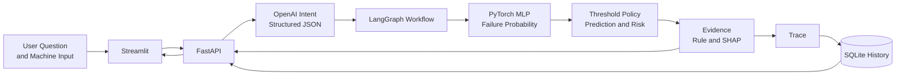
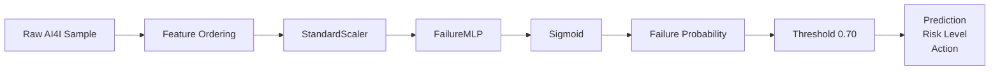
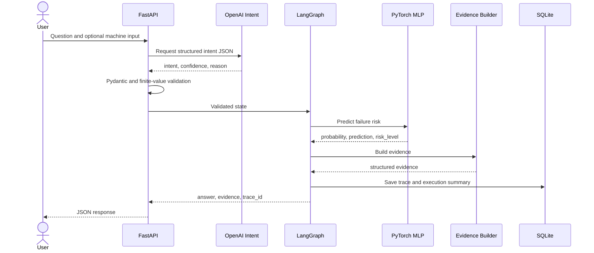

# AI4I 기반 설비 고장 예측

> AI4I 제조 설비 데이터를 이용해 고장 위험을 예측하고, PyTorch 모델의 Prediction을 Evidence, Agent Trace, SQLite History와 함께 제공하는 제조 AI 프로젝트입니다.

<p>
  
  
  
  
  
</p>

---

## Project Overview

| 항목 | 내용 |
|---|---|
| **기간** | 2026.05–07 |
| **형태** | 개인 프로젝트 |
| **목표** | 고장 확률뿐 아니라 예측 근거, Agent 처리 경로, 실행 이력을 함께 확인할 수 있는 제조 AI 서비스 구현 |
| **범위** | AI4I 데이터 분석, PyTorch MLP, 불균형 대응, Threshold 정책, SHAP, LangGraph, FastAPI, MCP, SQLite, Streamlit, 평가, 테스트, 문서화 |
| **기술** | Python, PyTorch, scikit-learn, SHAP, LangGraph, OpenAI API, FastAPI, MCP, SQLite, Streamlit, pytest |
| **대표 결과** | Recall 82.35%, F1 44.62%, Agent 평가 6/6 PASS, 전체 회귀 테스트 307 passed |

---

## Problem → Implementation → Result

| Problem | Implementation | Result |
|---|---|---|
| 고장 Class가 약 3.4%로 적어 Accuracy만으로 모델을 평가하기 어려움 | StandardScaler, `pos_weight`, Threshold 비교 적용 | Baseline Recall 0%에서 대표 실험 Recall 82.35%로 개선 |
| 고장 확률만으로는 판단 근거를 설명하기 어려움 | Prediction Summary, Rule Evidence, SHAP Local, Global Importance를 분리 | 예측 결과와 설명 정보를 구조화된 Evidence로 반환 |
| LLM이 수치와 결과까지 생성하면 모델 결과가 변할 수 있음 | OpenAI는 Intent 분류, PyTorch는 고장 확률, 정책 Layer는 Risk Level 담당 | LLM과 모델의 책임을 분리한 Agent Workflow 구성 |
| API 응답 이후 처리 경로를 다시 확인하기 어려움 | Trace Event와 실행 요약을 SQLite에 저장 | History API와 Dashboard에서 실행 이력 재조회 |
| Dashboard가 모델 정책을 중복 구현하면 결과가 달라질 수 있음 | Streamlit을 FastAPI Client로 구성 | 모델, Threshold, Evidence 정책을 Backend에서 일관되게 관리 |

---

## System Overview



| Layer | Responsibility |
|---|---|
| **OpenAI** | 자연어 질문을 구조화된 Intent JSON으로 분류 |
| **LangGraph** | Workflow State와 Route 관리 |
| **PyTorch MLP** | 고장 확률 계산 |
| **Threshold Policy** | Prediction과 Risk Level 결정 |
| **Evidence Layer** | Prediction Summary, Rule, SHAP 정보 생성 |
| **FastAPI** | 입력 검증, 정책 실행, 응답 제공 |
| **SQLite** | Trace와 실행 이력 저장 |
| **Streamlit** | 사용자 입력과 결과 시각화 |

### Core Design Principle

> LLM은 Intent를 구조화하고, 고장 확률은 PyTorch 모델이 계산하며, 최종 답변은 검증된 Prediction과 Evidence를 기반으로 생성합니다.

---

## Key Results

### Model Experiment

AI4I Train Label 비율:

| Class | Ratio |
|---|---:|
| Normal | 0.966125 |
| Failure | 0.033875 |

| Stage | Accuracy | Precision | Recall | F1 | FN | TP |
|---|---:|---:|---:|---:|---:|---:|
| Baseline, Threshold 0.50 | 0.9660 | 0.0000 | 0.0000 | 0.0000 | 68 | 0 |
| `pos_weight` 적용 | 0.8725 | 0.1445 | 0.5588 | 0.2296 | 30 | 38 |
| Scaling, Threshold 0.50 | 0.8730 | 0.2000 | 0.9118 | 0.3280 | 6 | 62 |
| Scaling, Threshold 0.70 | **0.9305** | **0.3060** | **0.8235** | **0.4462** | **12** | **56** |

> 위 표는 대표 실험 기록입니다. 고장 누락을 줄이기 위해 Recall을 우선했으며, Precision과의 Trade-off를 함께 확인했습니다.

### Agent and System Verification

| Verification | Result |
|---|---:|
| Deterministic Agent Scenarios | **6/6 PASS** |
| Real OpenAI E2E Validation | **5 scenarios PASS** |
| Repeated OpenAI Benchmark | **9/9 successful runs** |
| Benchmark Fallback Rate | **0.0** |
| Regression Tests | **307 passed** |
| Streamlit Dashboard | **4 pages** |

---

## Prediction Flow



### Input Features

1. Air temperature [K]
2. Process temperature [K]
3. Rotational speed [rpm]
4. Torque [Nm]
5. Tool wear [min]
6. Type

### Model Artifact

| Item | Value |
|---|---|
| Input Dimension | 6 |
| Hidden Dimension | 32 |
| Dropout | 0.2 |
| Threshold | 0.70 |

---

## Technical Details

<details open>
<summary><b>01 | Data and Model</b></summary>

<br>

### Dataset

| 항목 | 내용 |
|---|---|
| Dataset | AI4I 2020 Predictive Maintenance Dataset |
| Total | 10,000 rows |
| Train | 8,000 |
| Test | 2,000 |
| Target | Machine failure |
| Input | 6 Features |

### Model

```text
6 Input Features
→ Linear(6→32)
→ ReLU
→ Dropout(0.2)
→ Linear(32→1)
→ Raw Logit
```

- Loss: `BCEWithLogitsLoss(pos_weight)`
- Scaling: `StandardScaler`
- Output: Failure Probability
- Policy Threshold: 0.70

</details>

<details>
<summary><b>02 | Evidence</b></summary>

<br>

| Evidence | Content |
|---|---|
| **Prediction Summary** | Probability, Threshold, Prediction, Risk Level |
| **Rule Evidence** | 입력 Feature와 고정 정책 조건 |
| **SHAP Local** | 현재 입력에서 모델 출력에 상대적으로 기여한 Feature |
| **Global Importance** | 전체 평가 데이터 기준 Feature 영향도 |

> SHAP 값은 모델 계산 관점에서 입력 특성의 상대적 기여를 보여주며, 실제 물리적 고장 원인을 확정하지 않습니다.

</details>

<details>
<summary><b>03 | Agent Workflow</b></summary>

<br>



### Intent Processing

- OpenAI Structured Output
- Pydantic Schema Validation
- `isfinite` Check
- Rule-based Fallback
- Internal Error Message Protection

</details>

<details>
<summary><b>04 | Trace and History</b></summary>

<br>

Trace에는 다음 정보를 기록합니다.

- Intent Classification
- Route Selection
- Model Prediction
- Evidence Generation
- Fallback Status
- Execution Status
- Error Summary
- Duration
- Trace ID

실행 요약을 SQLite에 저장해 API 응답 이후에도 다시 조회할 수 있도록 구성했습니다.

</details>

<details>
<summary><b>05 | FastAPI, MCP, and Streamlit</b></summary>

<br>

### API Endpoints

| Method | Endpoint | Role |
|---|---|---|
| POST | `/agent/failure-prediction` | 직접 고장 위험 예측 |
| POST | `/agent/failure-prediction/explanation` | Prediction과 Evidence 반환 |
| POST | `/agent/langgraph-query` | Intent와 Agent Workflow 실행 |
| GET | `/agent/executions` | 실행 이력 목록 |
| GET | `/agent/executions/{trace_id}` | Trace 상세 조회 |

### Streamlit Pages

1. Failure Prediction
2. Evidence
3. Agent Query
4. Execution History

### MCP

- stdio 방식 MCP Server
- `get_dataset_schema` Tool 제공
- Dataset Schema 조회 기능을 Agent Workflow와 분리

</details>

<details>
<summary><b>06 | Validation and Safety</b></summary>

<br>

### LLM Output Validation

다음 입력을 방어합니다.

- 정의되지 않은 Intent
- `NaN`, `inf` Confidence
- `reason=None`
- Schema Mismatch
- OpenAI Failure

### Multi-turn Safety

이전 설비 입력을 자동 재사용하지 않습니다. 사용자가 명시하지 않은 이전 센서값이 새로운 설비 Prediction에 섞이는 것을 방지합니다.

### Dashboard Policy

Streamlit은 모델, LangGraph, SQLite를 직접 실행하지 않고 `DashboardApiClient → FastAPI` 구조로 결과를 받습니다.

</details>

<details>
<summary><b>07 | Current Scope and Next Steps</b></summary>

<br>

### Current Scope

- 공개 AI4I Dataset 기반 프로젝트
- 6개 상태 Feature를 이용한 Tabular Classification
- 순차 Window 기반 Time Series 예측 모델은 아님
- SHAP는 모델 설명 도구이며 실제 고장 원인을 확정하지 않음
- OpenAI E2E는 API와 Network 상태에 영향을 받을 수 있음

### Next Steps

1. Seed와 Artifact Version 완전 고정
2. PR-AUC, ROC-AUC, Calibration 추가
3. One-hot Encoding과 Feature 처리 비교
4. Time-based Split 또는 실제 시계열 설비 데이터 적용
5. Data Drift와 Model Drift 감지
6. 인증, 권한, 모델 Registry, 운영 Monitoring 확장

</details>

---

## API Response

```json
{
  "prediction": 1,
  "failure_probability": 0.993,
  "threshold": 0.7,
  "risk_level": "HIGH",
  "recommended_action": "설비 상태를 우선 점검하세요.",
  "evidence": {
    "prediction_summary": {},
    "rule_evidence": [],
    "shap_local": []
  },
  "trace_id": "..."
}
```

---

## Run and Verify

### Setup

```powershell
python -m venv .venv
.\.venv\Scripts\Activate.ps1
python -m pip install -r .\requirements.txt
```

### Environment

```powershell
$env:OPENAI_API_KEY="your-key"
```

### FastAPI

```powershell
uvicorn src.api.main:app --reload
```

### Streamlit

```powershell
streamlit run .\src\dashboard\app.py
```

### Tests

```powershell
python -m pytest .\tests -q
```

Expected result:

```text
307 passed
```

---

## Project Structure

```text
manufacturing-ai-quality-agent-reference/
├── models/
│   └── failure_mlp/
│       ├── model.pt
│       ├── scaler.joblib
│       ├── metadata.json
│       ├── shap_background.pt
│       └── global_importance.json
├── reports/
│   ├── artifacts/
│   └── day*_summary.md
├── scripts/
├── src/
│   ├── agent/
│   ├── api/
│   ├── dashboard/
│   ├── data/
│   ├── evaluation/
│   ├── inference/
│   ├── interpretability/
│   ├── mcp_server/
│   ├── models/
│   ├── persistence/
│   ├── services/
│   ├── training/
│   └── utils/
├── tests/
├── README.md
├── requirements.txt
└── pytest.ini
```

---

## What This Project Demonstrates

- 불균형 제조 데이터에서 Accuracy의 한계를 확인하고 Recall, F1, False Negative를 함께 평가한 경험
- PyTorch 모델과 LLM의 책임을 분리한 설계 경험
- Prediction을 Rule과 SHAP Evidence로 구조화한 경험
- Agent 처리 경로를 Trace와 SQLite History로 저장한 경험
- 모델, API, Dashboard 정책을 Backend에서 일관되게 관리한 경험
- 실제 OpenAI 호출, Agent 평가, 회귀 테스트를 통해 시스템을 검증한 경험

---

## Contact

- Developer: 김수진
- GitHub: [github.com/lightleaping](https://github.com/lightleaping)
- Email: workingskyroad@gmail.com
