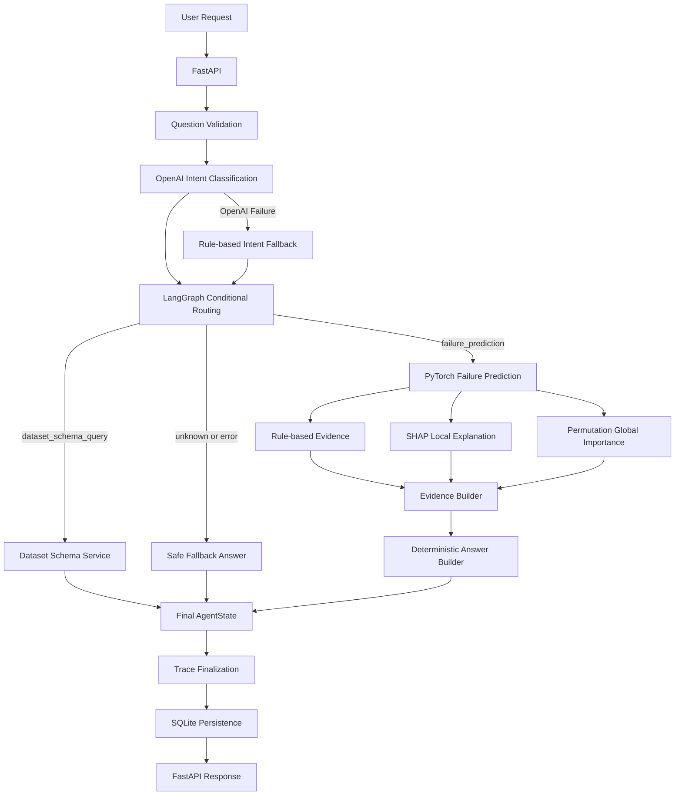

# Day 25 - Final Repository, README, Architecture, Portfolio and Interview Summary

## 1. Day 25 목표

Day 25의 목표는 Day 1~24에서 구현한 전체 Repository를 최종 검토하고, README·Architecture·Portfolio·면접 설명을 현재 코드 기준으로 일치시키는 것입니다.

최종 정리 범위:

- Repository 상태와 전체 회귀 테스트 확인
- 깨진 한글·비정상 공백·오래된 문구 검토
- OpenAI 내부 예외 상세 비노출 보강
- README 최종 Architecture 반영
- Streamlit Dashboard 역할·실행 방법·환경 변수 문서화
- Day 23~25 개발 단계 반영
- 현재 한계와 향후 확장 방향 갱신
- Portfolio·면접 설명 구조화

---

## 2. 최종 검토 결과

### 2.1 전체 회귀 테스트

```text
307 passed
```

Day 25 작업 전 전체 Test Suite를 실행해 `307 passed`를 확인했습니다.

### 2.2 추가 검증

- Dashboard 관련 Test: `67 passed`
- Dashboard 제외 Backend Test: `240 passed`
- `python -m compileall src tests scripts -q`: 통과
- `python -m pip check`: `No broken requirements found.`
- `git diff --check`: 출력 없음
- 변경 파일 깨진 한글·충돌 표시·비정상 공백 검사: 통과

### 2.3 Day 25 수정 파일

```text
README.md
reports/day24_streamlit_manufacturing_ai_dashboard_summary.md
src/agent/operational_explainer.py
src/api/failure_agent_api.py
tests/test_operational_explainer.py
```

---

## 3. 코드·문서 수정 내용

### 3.1 OpenAI 내부 예외 상세 비노출

`operational_explainer.py`에서 OpenAI JSON Parsing 등 예외가 발생했을 때 `JSONDecodeError`, 원본 Response 내용, 내부 예외 메시지를 외부 API Response에 그대로 노출하지 않도록 수정했습니다.

변경 후 외부 오류 문구:

```text
OpenAI 운영 해설을 생성하지 못했습니다.
```

이 수정은 OpenAI 설명 실패와 기존 Prediction 결과를 분리하고, 내부 실행 정보를 외부에 노출하지 않는 Agent Safety 정책과 일치합니다.

### 3.2 회귀 테스트 보강

`tests/test_operational_explainer.py`에 다음을 검증하는 Assertion을 추가했습니다.

- 외부 `error`가 안전한 고정 문구인지 확인
- `JSONDecodeError`가 노출되지 않는지 확인
- 잘못된 OpenAI 원본 Response `not-json`이 노출되지 않는지 확인

### 3.3 깨진 한글 복구

- `failure_agent_api.py` OpenAI 운영 해설 Endpoint Docstring 복구
- Day 24 보고서의 깨진 한글 예시 문구 교체

### 3.4 README 최종 갱신

- 최종 Request Architecture 추가
- OpenAI Operational Explanation Endpoint 설명 추가
- Streamlit Dashboard 역할·화면·설계 원칙 추가
- Dashboard 환경 변수 추가
- 최종 Test 결과 `307 passed` 반영
- 현재 Repository 구조 갱신
- Day 23·24·25 개발 단계 추가
- 현재 한계와 실제 향후 확장 방향 갱신
- Portfolio·면접 설명 확장

---

## 4. 전체 Architecture

### 4.1 Final Request Architecture

최종 사용자 요청 구조:

```text
사용자
  ↓
Streamlit Dashboard
  ↓
DashboardApiClient
  ↓ HTTP
FastAPI
  ├─ LangGraph Agent
  ├─ OpenAI Intent Classification
  ├─ PyTorch Failure Prediction
  ├─ Evidence Builder
  ├─ Answer Builder
  ├─ Trace / Observability
  └─ SQLite Execution Persistence
  ↓
FastAPI Response
  ↓
Streamlit Dashboard
```

Streamlit Dashboard는 사용자 입력과 결과 표시를 담당합니다.
`DashboardApiClient`는 FastAPI 통신과 HTTP 오류 변환을 담당합니다.
FastAPI는 Model, LangGraph, Evidence, Trace, SQLite를 연결하는 Backend 실행 경계입니다.

Dashboard는 PyTorch Model, LangGraph workflow, SQLite를 직접 실행하지 않습니다.
이를 통해 비즈니스 로직 중복을 방지하고, Prediction·Threshold·Risk Level·Evidence 정책을 Backend 한 곳에서 관리합니다.

아래 Mermaid Diagram은 FastAPI Backend 내부의 주요 처리 흐름을 보여줍니다.




---


---

## 5. FastAPI·Streamlit Dashboard

API 실행:

```powershell
uvicorn src.api.main:app --reload
```

Swagger UI:

```text
http://127.0.0.1:8000/docs
```

현재 Endpoint:

| Method | Endpoint | 역할 |
|---|---|---|
| `POST` | `/agent/failure-prediction` | 정형 설비 입력 기반 직접 Prediction |
| `POST` | `/agent/failure-prediction/explanation` | 확정된 Prediction·Evidence 기반 OpenAI 쉬운 운영 해설 |
| `POST` | `/agent/langgraph-query` | 자연어 질문 기반 LangGraph Agent |
| `GET` | `/agent/executions` | 최근 Agent 실행 이력 |
| `GET` | `/agent/executions/{trace_id}` | 특정 실행 상세 조회 |

---

### 5.1 Direct Failure Prediction

```http
POST /agent/failure-prediction
```

요청 예:

```json
{
  "air_temperature": 303.0,
  "process_temperature": 312.5,
  "rotational_speed": 1380.0,
  "torque": 62.0,
  "tool_wear": 220.0,
  "type": "L",
  "include_shap": true,
  "include_global_importance": true
}
```

응답 주요 필드:

```json
{
  "prediction": 1,
  "probability": 0.9929707646,
  "threshold": 0.7,
  "risk_level": "HIGH",
  "recommended_action": "고장 위험이 높습니다. 설비 점검 및 생산 조건 확인을 권장합니다.",
  "evidence": [],
  "answer": "...",
  "warnings": [],
  "limitations": []
}
```

---

### 5.2 OpenAI Operational Explanation

```http
POST /agent/failure-prediction/explanation
```

이 Endpoint는 이미 확정된 Prediction과 Evidence를 비전문가가 이해하기 쉬운 한국어 운영 해설로 변환합니다.

처리 흐름:

```text
확정된 Prediction Result
        +
확정된 Evidence
        ↓
OpenAI 쉬운 운영 해설
        ↓
Structured Response
        ↓
Streamlit Dashboard 표시

Prediction·Evidence
→ 변경 없음
```

중요 정책:

- Prediction을 다시 실행하지 않습니다.
- Probability를 다시 계산하지 않습니다.
- Threshold를 변경하지 않습니다.
- Risk Level을 다시 판단하지 않습니다.
- Evidence를 새로 계산하거나 변경하지 않습니다.
- 실제 고장 발생이나 물리적 원인을 확정하지 않습니다.
- OpenAI 호출 실패는 기존 Prediction 실패와 분리합니다.
- 내부 OpenAI 예외 종류와 상세 메시지는 외부 응답에 그대로 노출하지 않습니다.

응답 주요 필드:

```text
summary
key_signals
recommended_checks
caution
source
model
error
```

Dashboard에서는 사용자가 쉬운 설명 버튼을 눌렀을 때만 이 Endpoint를 호출합니다.

---

### 5.3 LangGraph Agent Query

```http
POST /agent/langgraph-query
```

요청 예:

```json
{
  "question": "이 설비 조건의 고장 위험을 예측해줘.",
  "chat_history": [],
  "raw_sample": {
    "air_temperature": 303.0,
    "process_temperature": 312.5,
    "rotational_speed": 1380.0,
    "torque": 62.0,
    "tool_wear": 220.0,
    "type": "L"
  },
  "include_shap": true,
  "include_global_importance": true
}
```

응답에는 최종 Agent 결과와 함께 다음 Trace 정보가 포함됩니다.

```text
trace_id

trace_status

trace_started_at

trace_finished_at

trace_duration_ms

fallback_occurred

trace_events
```

---

### 5.4 Streamlit Dashboard

Streamlit Dashboard는 FastAPI Backend가 반환한 예측·Evidence·Agent·Trace 결과를 사용자가 이해하기 쉽게 보여주는 Presentation Layer입니다.

실행:

```powershell
python -m streamlit run src\dashboard\app.py
```

기본 주소:

```text
http://localhost:8501
```

주요 화면:

| 화면 | 주요 역할 |
|---|---|
| 설비 고장 위험 분석 | 설비 입력, Prediction, Probability, Threshold, Risk Level, 점검 행동 표시 |
| Evidence 분석 | Prediction Summary, Rule-based Evidence, SHAP Local Evidence, Global Importance 상세 표시 |
| AI 질의 응답 | LangGraph Agent 질문, Chat History 문맥, 현재 Raw Sample 선택 전송 |
| Trace·Execution History | SQLite 실행 이력, Trace Event, Warning, Error, 상세 응답 조회 |

역할 분리:

```text
Streamlit
→ 사용자 입력과 결과 표시

DashboardApiClient
→ FastAPI HTTP 통신

FastAPI
→ Backend 실행 진입점과 비즈니스 로직

LangGraph
→ Agent 흐름

PyTorch
→ 고장 위험 예측

SQLite
→ 실행 이력 저장
```

중요 설계 원칙:

- Dashboard는 PyTorch Model을 직접 로드하거나 실행하지 않습니다.
- Dashboard는 LangGraph workflow를 직접 실행하지 않습니다.
- Dashboard는 SQLite 파일을 직접 열거나 SQL Query를 실행하지 않습니다.
- Prediction, Probability, Threshold, Risk Level, Evidence, Answer를 Dashboard에서 다시 계산하지 않습니다.
- `chat_history`는 질문 문맥 이해에만 사용합니다.
- 이전 요청의 Raw Sample은 다음 고장 예측 요청에 자동 재사용하지 않습니다.

이 구조를 통해 Backend 비즈니스 로직의 중복을 방지하고, 다른 Frontend에서도 같은 FastAPI를 재사용할 수 있습니다.

---


---

## 6. Agent Safety

현재 구현된 주요 안전 정책:

### OpenAI 실패

```text
OpenAI API Key 누락

OpenAI 호출 실패

빈 응답

JSON Parsing 실패

Payload 검증 실패

        ↓

Rule-based Intent Fallback
```

### 이전 설비 입력 자동 재사용 금지

```text
이전 Chat에 설비 조건 존재
        +
현재 요청에 Raw Sample 없음
        ↓
이전 값을 자동 재사용하지 않음
        ↓
현재 입력값 다시 요청
```

### Secret 비노출

API Key, 환경 변수, Secret 출력 요청은 안전한 Fallback으로 처리합니다.

### 내부 오류 정보 비노출

OpenAI 내부 예외 문자열을 사용자 응답에 그대로 노출하지 않습니다.

### 비정상 수치 방어

`NaN`, `Infinity`, 잘못된 Numeric 값은 Evidence와 Answer에 그대로 노출하지 않고 안전한 기본값으로 정규화합니다.

---


---

## 7. Test

전체 회귀 테스트:

```powershell
pytest -v
```

Day 25 최종 검토 기준 결과:

```text
307 passed
```

검증 범위:

- AI4I Schema와 전처리
- PyTorch 학습·평가·추론
- Threshold 선택
- Permutation Importance
- SHAP Explanation
- Evidence Builder
- Answer Builder
- OpenAI Intent Validation
- Rule-based Fallback
- Multi-turn Context
- LangGraph Node·Route
- Trace·Observability
- FastAPI Request·Response
- Error Handling
- Artifact Cache
- SQLite Persistence
- MCP Server
- Agent Evaluation·Safety
- DashboardApiClient 설정·HTTP 오류 처리
- Streamlit Dashboard 진입점·Page·Session State
- 설비 고장 위험 분석·Evidence 분석·Agent Chat·Execution History
- OpenAI 쉬운 운영 해설과 내부 예외 상세 비노출
- Chat History와 Backend 문맥 기록 분리
- 이전 Raw Sample 자동 재사용 금지
- 초보자 중심 Layout·Typography·한글 문구·이모티콘 제거

---


---

## 8. 개발 단계

| 단계 | 주요 내용 |
|---|---|
| Day 1~3 | AI4I Schema, 데이터 구조, 프로젝트 기반 |
| Day 4 | Class Imbalance, `pos_weight`, Scaling, Threshold 비교 |
| Day 5 | Model·Scaler·Metadata Artifact와 단일 추론 |
| Day 6 | Permutation Importance |
| Day 7 | Local Rule-based Explanation |
| Day 8 | SHAP Explanation |
| Day 9 | Agent Evidence 표준화 |
| Day 10 | FastAPI Prediction API |
| Day 11 | SHAP API 통합 |
| Day 12 | Error Handling과 Artifact Cache |
| Day 13 | OpenAI Intent Classification과 LangGraph |
| Day 14 | LangGraph FastAPI Endpoint |
| Day 15 | Chat History와 Multi-turn |
| Day 16 | Trace와 Observability |
| Day 17 | 실제 OpenAI E2E 검증 |
| Day 18 | E2E Reliability·Performance Benchmark |
| Day 19 | SQLite Execution History |
| Day 20 | 실제 MCP stdio Server·Client 연결 |
| Day 21 | Agent Evaluation과 Safety |
| Day 22 | 방어 로직, 결함 수정, 전체 회귀 테스트 |
| Day 23 | Dashboard Architecture, 설정, `DashboardApiClient` |
| Day 24 | Streamlit 제조 AI Dashboard, 초보자 중심 UX, OpenAI 쉬운 운영 해설 |
| Day 25 | 최종 Repository 검토, README, Architecture, Portfolio·면접 문서화 |

---


---

## 9. 현재 한계

1. AI4I 2020 공개 Dataset 기반이며 실제 기업 제조 데이터와 분포·센서 환경이 다를 수 있습니다.

2. 현재 Agent가 지원하는 주요 Intent는 다음 세 개입니다.

```text
failure_prediction

dataset_schema_query

unknown
```

3. 실시간 센서 Streaming, Online Inference, 자동 재학습은 구현하지 않았습니다.

4. 현재 MCP Tool은 Dataset Schema 조회 중심이며 Prediction·Trace·이력 조회 Tool까지 확장하지 않았습니다.

5. PyTorch 학습 Seed를 완전히 고정하지 않았으므로 재학습 시 Model Artifact와 Threshold가 달라질 수 있습니다.

6. SHAP과 Permutation Importance는 모델의 예측 기여도와 중요도를 설명하지만 물리적 원인이나 인과관계를 증명하지 않습니다.

7. Rule-based Evidence는 사람이 정의한 운영 규칙이며 실제 설비 진단 기준을 대체하지 않습니다.

8. OpenAI 쉬운 운영 해설은 확정된 Prediction과 Evidence를 설명할 뿐 실제 고장 발생, 물리적 원인, 정비 결과를 확정하지 않습니다.

9. Day 18 Benchmark는 제한된 로컬 TestClient 환경의 측정 결과이며 운영 SLA나 실제 배포 성능을 의미하지 않습니다.

10. SQLite는 학습·단일 애플리케이션 중심 구조입니다. 다중 사용자 운영 환경에서는 PostgreSQL 등 별도 DB를 검토해야 합니다.

11. Question 원문과 Raw Sample을 저장하므로 운영 환경에서는 개인정보·민감정보 마스킹, 접근 제어, 암호화, 보존 기간 정책이 필요합니다.

12. 인증·인가, Rate Limit, HTTPS, Secret Manager, 중앙 Logging, 배포 모니터링은 현재 범위에 포함하지 않았습니다.

13. Streamlit Session State는 브라우저 Session 중심이며 장기 사용자 상태 저장이나 다중 사용자 권한 관리를 제공하지 않습니다.

14. 실제 제조 현장에 적용하려면 현장 데이터 검증, 설비 전문가 검토, 오탐·미탐 비용 분석, 운영 승인 절차가 추가로 필요합니다.

---


---

## 10. 향후 확장

우선순위가 높은 확장 방향:

1. 실제 제조 데이터 기반 외부 검증과 Drift Monitoring

2. 실시간 센서 Streaming, Online Inference, Batch Prediction

3. MCP Tool 확장

```text
Dataset Schema 조회

Failure Prediction

Evidence 조회

Trace 조회

Execution History 조회
```

4. PostgreSQL 기반 다중 사용자 Persistence와 조회 성능 개선

5. 인증·인가, Role 기반 접근 제어, Rate Limit, HTTPS 적용

6. Question·Raw Sample 마스킹, 암호화, 보존 기간, 삭제 정책

7. Model·API·Agent·Dashboard 통합 Monitoring과 배포 자동화

8. Agent Evaluation Dataset 확대와 Routing·Safety 회귀 평가 자동화

9. Model 재학습 재현성을 위한 Seed·환경·Artifact Version 관리 강화

10. Dashboard에 Evaluation 추세, Model Version, 운영 지표 시각화 추가

---


---

## 11. 포트폴리오·면접 설명

### 11.1 프로젝트 한 문장

> AI4I 제조 데이터를 기반으로 PyTorch 설비 고장 위험 예측 모델을 구현하고, OpenAI Intent Classification, LangGraph Routing, Evidence 기반 답변, Trace, SQLite Persistence, MCP, Streamlit Dashboard를 FastAPI 중심 구조로 통합한 제조 AI Agent 프로젝트입니다.

### 11.2 문제 상황

제조 AI 서비스를 구성할 때 Model Prediction만 제공하면 사용자는 위험 확률이 왜 높게 나왔는지, 어떤 입력이 영향을 주었는지, 다음에 무엇을 확인해야 하는지 이해하기 어렵습니다.

또한 Dashboard가 PyTorch Model, LangGraph, SQLite를 직접 실행하면 다음 문제가 발생할 수 있습니다.

- Frontend와 Backend에 Prediction·Threshold·Risk Level 정책이 중복됩니다.
- Model과 Artifact를 여러 위치에서 로드하게 됩니다.
- Evidence와 Answer 생성 규칙이 화면마다 달라질 수 있습니다.
- 오류 처리와 테스트 범위가 분산됩니다.
- 다른 Frontend에서 Backend 기능을 재사용하기 어려워집니다.

### 11.3 고민

프로젝트를 확장하면서 다음 기준을 우선했습니다.

1. 고장 확률과 Risk Level은 LLM이 아니라 PyTorch Model과 고정된 Threshold 정책이 결정해야 합니다.

2. LLM은 수치와 Evidence를 임의로 생성하지 않고, 제한된 역할만 담당해야 합니다.

3. 최종 Answer는 검증된 Prediction과 Evidence를 우선하여 구성해야 합니다.

4. Dashboard는 Backend 비즈니스 로직을 다시 구현하지 않고 FastAPI를 통해 결과를 받아야 합니다.

5. Chat History는 질문 문맥 이해에 사용할 수 있지만, 이전 Raw Sample을 새 Prediction에 자동 재사용하면 안 됩니다.

6. OpenAI 부가 기능이 실패해도 이미 확정된 Prediction 결과는 유지해야 합니다.

7. 기능 추가 후에는 작은 단위 테스트, 관련 회귀 테스트, 전체 회귀 테스트 순서로 기존 동작을 확인해야 합니다.

### 11.4 해결 방안

최종 요청 구조를 다음과 같이 분리했습니다.

```text
사용자
  ↓
Streamlit Dashboard
  ↓
DashboardApiClient
  ↓ HTTP
FastAPI
  ├─ LangGraph Agent
  ├─ OpenAI Intent Classification
  ├─ PyTorch Failure Prediction
  ├─ Evidence Builder
  ├─ Answer Builder
  ├─ Trace / Observability
  └─ SQLite Execution Persistence
  ↓
FastAPI Response
  ↓
Streamlit Dashboard
```

핵심 설계 원칙:

- PyTorch Model이 Prediction과 Probability를 계산합니다.
- Threshold 정책이 Risk Level을 결정합니다.
- Evidence Builder가 Prediction Summary, Rule-based Evidence, SHAP Local Evidence를 표준화합니다.
- Answer Builder가 검증된 Prediction과 Evidence를 기반으로 최종 답변을 구성합니다.
- OpenAI는 Intent JSON 분류와 선택적 쉬운 운영 해설에만 사용합니다.
- Dashboard는 `DashboardApiClient`를 통해 FastAPI만 호출합니다.
- Trace와 SQLite Persistence로 요청 처리 흐름과 실행 결과를 추적합니다.
- MCP stdio Server·Client 연결을 실제로 검증했습니다.

### 11.5 적용

구현한 주요 기능:

| 영역 | 적용 내용 |
|---|---|
| Model | PyTorch MLP, StandardScaler, Class Imbalance 대응, Threshold 0.7 |
| Explanation | Rule-based Evidence, SHAP Local Explanation, Permutation Importance |
| Agent | OpenAI Intent JSON, Rule-based Fallback, LangGraph Routing |
| API | Prediction, OpenAI 운영 해설, LangGraph Query, Execution History |
| Reliability | Artifact Cache, Error Handling, 비정상 수치 방어 |
| Observability | Trace ID, Trace Event, Duration, Warning, Error |
| Persistence | SQLite 실행 이력 저장·목록·상세 조회 |
| MCP | FastMCP stdio Server, Tool 목록 조회, Tool 호출 검증 |
| Evaluation | Routing, Safety, Intent, Answer Consistency, Multi-turn 평가 |
| Dashboard | 설비 고장 위험 분석, Evidence 분석, AI 질의 응답, 실행 이력 |
| UX | 초보자 중심 결론·행동 우선 배치, Typography, Card, 쉬운 운영 해설 |
| Test | Day 25 최종 기준 `307 passed` |

### 11.6 효과·의미

1. Model Prediction, Evidence, Agent Answer, Trace, Persistence, Dashboard를 하나의 요청 흐름으로 연결했습니다.

2. LLM이 고장 확률이나 근거를 임의로 생성하지 않도록 역할을 제한했습니다.

3. OpenAI 실패 시 Rule-based Intent Fallback을 사용해 핵심 Agent 흐름을 유지했습니다.

4. OpenAI 쉬운 운영 해설 실패를 Prediction 실패와 분리해 이미 확정된 결과를 보호했습니다.

5. Dashboard와 Backend의 역할을 분리해 비즈니스 로직 중복을 방지하고 다른 Frontend에서도 FastAPI를 재사용할 수 있게 했습니다.

6. Chat History와 Raw Sample을 분리해 오래된 설비 조건이 새 예측에 자동 사용되는 위험을 방지했습니다.

7. Trace와 SQLite 실행 이력을 통해 요청별 처리 과정과 결과를 확인할 수 있게 했습니다.

8. 단위 테스트, 관련 회귀 테스트, 전체 회귀 테스트를 반복해 기능 확장 후 기존 동작을 검증했습니다.

### 11.7 핵심 설계 설명

#### LLM 사용 범위

> LLM은 Intent를 구조화된 JSON으로 반환하며, 최종 답변은 예측 결과와 Evidence를 우선하여 구성했습니다.

고장 확률과 Prediction은 PyTorch Model이 계산합니다. LLM은 `intent`, `confidence`, `reason`을 구조화된 형태로 반환하며, 실패하거나 잘못된 Payload를 반환하면 Rule-based Fallback으로 전환합니다.

OpenAI 쉬운 운영 해설은 확정된 Prediction과 Evidence를 비전문가가 이해하기 쉬운 문장으로 변환하지만 Prediction, Probability, Threshold, Risk Level, Evidence를 다시 계산하거나 변경하지 않습니다.

#### Dashboard 역할 분리

> Streamlit Dashboard는 Model·LangGraph·SQLite를 직접 실행하지 않고, DashboardApiClient를 통해 FastAPI를 호출하도록 구성했습니다.
>
> 이를 통해 Backend 비즈니스 로직의 중복을 방지하고, Prediction·Threshold·Risk Level·Evidence 정책을 한 곳에서 관리했습니다.

#### OpenAI 쉬운 운영 해설

> OpenAI는 예측을 다시 수행하거나 결과를 변경하지 않습니다.
>
> 확정된 Prediction과 Evidence를 입력으로 받아 비전문가가 이해하기 쉬운 운영 설명만 생성합니다.

내부 OpenAI 예외 종류와 상세 메시지는 외부 응답에 그대로 노출하지 않으며, 설명 생성 실패는 기존 Prediction 결과와 분리합니다.

#### Multi-turn과 Raw Sample 안전 정책

> Chat History는 질문 문맥 이해에만 사용합니다.
>
> 이전 요청의 Raw Sample을 다음 고장 예측에 자동 재사용하지 않아 오래된 설비 조건으로 잘못 예측하는 위험을 방지했습니다.

### 11.8 AI 개발 도구 활용

> AI를 보조 도구로 활용해 초안을 만들고, 이후 직접 실행·검증·수정·문서화했습니다.

AI가 제안한 코드나 문서를 그대로 완료 결과로 간주하지 않았습니다. 다음 절차로 확인했습니다.

```text
초안 생성
  ↓
기존 코드와 연결 구조 확인
  ↓
테스트로 현재 동작·문제 재현
  ↓
작은 범위 수정
  ↓
관련 테스트 실행
  ↓
전체 회귀 테스트
  ↓
README·보고서·면접 설명 문서화
```

직접 확인한 항목:

- FastAPI Endpoint Request·Response
- PyTorch Prediction·Probability·Threshold·Risk Level
- Evidence 구조와 SHAP 방향
- LangGraph Node·Route·Fallback
- Multi-turn Context와 Raw Sample 비재사용
- Trace Event와 SQLite Persistence
- MCP stdio Server·Client 연결
- DashboardApiClient와 Streamlit Page
- OpenAI 운영 해설 실패 분리와 내부 예외 비노출
- Agent Evaluation과 전체 회귀 테스트

### 11.9 예상 면접 질문과 답변

#### Q1. 왜 LLM이 고장 확률을 직접 판단하지 않게 했나요?

고장 확률은 학습된 PyTorch Model이 계산하고 Risk Level은 고정된 Threshold 정책으로 결정했습니다. LLM은 Intent 분류와 쉬운 설명에만 사용해 수치와 근거를 임의로 생성할 가능성을 줄였습니다.

#### Q2. 최종 답변은 어떻게 신뢰성을 확보했나요?

Prediction 결과를 `prediction_summary`, `rule_based`, `shap_local` Evidence로 표준화한 뒤 Answer Builder가 이 Evidence를 우선해 결정론적으로 답변을 구성하도록 했습니다. OpenAI가 최종 수치나 핵심 근거를 새로 만들지 않습니다.

#### Q3. OpenAI 호출이 실패하면 전체 Agent도 실패하나요?

Intent Classification이 실패하면 Rule-based Fallback으로 전환합니다. 쉬운 운영 해설이 실패하면 설명의 `error` 필드로 분리하고 이미 확정된 Prediction과 Evidence는 유지합니다.

#### Q4. 왜 Dashboard에서 Model을 직접 실행하지 않았나요?

Dashboard가 Model, LangGraph, SQLite를 직접 실행하면 Backend 정책이 중복되고 결과 일관성이 깨질 수 있습니다. `DashboardApiClient → FastAPI` 구조로 연결해 Prediction, Threshold, Risk Level, Evidence 정책을 Backend 한 곳에서 관리했습니다.

#### Q5. Multi-turn에서 이전 설비 입력을 자동 재사용하지 않은 이유는 무엇인가요?

이전 Raw Sample은 오래된 설비 상태일 수 있습니다. Chat History는 질문 문맥에만 사용하고 현재 요청에 Raw Sample이 없으면 입력을 다시 요청해 잘못된 조건으로 새 Prediction을 수행하는 위험을 줄였습니다.

#### Q6. SHAP 값이 높으면 실제 고장 원인이라고 볼 수 있나요?

아닙니다. SHAP은 해당 Model Prediction에 대한 특성 기여도를 설명합니다. 물리적 원인이나 인과관계를 증명하지 않으므로 실제 정비 판단에는 현장 데이터와 설비 전문가 검토가 추가로 필요합니다.

#### Q7. 프로젝트의 가장 중요한 아키텍처 결정은 무엇인가요?

FastAPI를 Backend 실행 경계로 두고 Model, Agent, Evidence, Trace, Persistence를 연결한 뒤 Dashboard는 API만 호출하도록 역할을 분리한 것입니다. 이 구조로 비즈니스 로직 중복을 줄이고 기능별 테스트와 재사용성을 높였습니다.

#### Q8. AI 도구를 사용한 부분과 직접 수행한 부분은 무엇인가요?

AI는 코드와 문서 초안을 만드는 보조 도구로 사용했습니다. 저는 기존 구조 확인, 명령 실행, 오류 재현, 코드 수정, 테스트 결과 해석, 회귀 검증, Architecture·README·한계·면접 설명 문서화를 직접 수행했습니다.

---

---

## 12. Day 25 최종 결론

Day 25에서는 새로운 대규모 기능을 추가하기보다, Day 1~24의 Model·Agent·API·Trace·Persistence·MCP·Dashboard 구조가 하나의 Repository에서 일관되게 설명되도록 최종 검토했습니다.

특히 OpenAI 운영 해설의 내부 예외 상세 비노출을 보강하고, 이를 회귀 테스트로 고정했습니다.

README에는 최종 Architecture, Dashboard 역할 분리, 실행 방법, 환경 변수, 개발 단계, 현재 한계, 향후 확장, Portfolio·면접 설명을 현재 코드와 일치하도록 반영했습니다.

최종 검증 결과:

```text
307 passed
git diff --check: no output
changed file text validation: PASS
```

이로써 Manufacturing AI Quality Agent Reference의 Day 25 코드·테스트·README·Architecture·Portfolio·면접 문서화를 마무리합니다.

